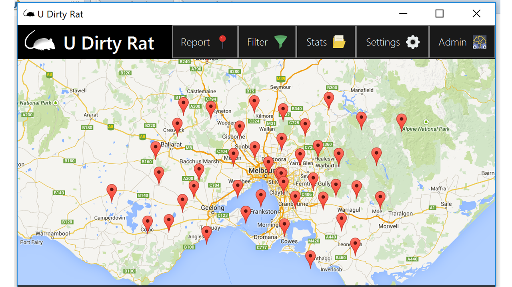

# Right Sightings - JavaFX Application

Javafx application that lets you view and report rat sightings in NYC.
The data used for this project can be found here: https://data.cityofnewyork.us/Social-Services/Rat-Sightings/3q43-55fe

Main features include: Adding new rat sightings that will update the database, filtering the main viewing of rat sightings, viewing summary statistics, changing overall settings and accessing admin features (adding or removing accounts).

# Login

# Main Application Screen 

